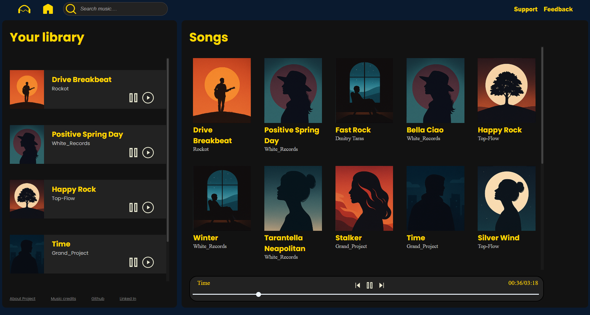

# 🎧 ListenUp


ListenUp is a sleek and modern music streaming web app that lets you discover, play, and enjoy your favorite songs effortlessly.

---

## 🚀 Features
- 🎵 **Stream music** online
- 🔍 **Search** for songs and artists
- ❤️ **Create & manage playlists**
- 📱 **Responsive design** (coming soon)

---

## 🛠 Tech Stack
- **HTML**
- **CSS**
- **JavaScript**

---

## 📸 Screenshots
 <!-- Replace with your path or URL -->

---

## 📦 Installation
1. **Clone the repo**
   ```bash
   git clone https://github.com/avaneeshsawant-git/ListenUp.git
